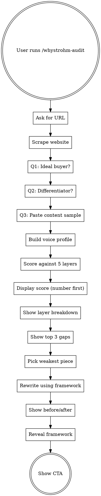

# WhyStrohm Content Infrastructure Audit

A two-phase content diagnostic: **score your content** against a 5-layer framework, then **watch one piece get fixed live**.

## Flow

## Phase 1: The Diagnostic

### Step 1: Get the URL

Ask: **"What's your website URL?"**

Nothing else. One question. Wait for answer.

### Step 2: Scrape the Website

Use WebFetch to pull:
1. Homepage
2. About or Services page (look for /about, /services, /what-we-do, or similar)
3. Most recent blog post (if /blog exists)

While scraping, tell the user: "Pulling your site now — analyzing voice, positioning, and content patterns..."

### Step 3: Build Voice Profile

Read `rules/voice-analysis.md`. Build the internal voice profile from the scraped pages. Do NOT display this to the user — it's used for scoring.

### Step 4: Ask Three Questions

Ask these ONE AT A TIME. Wait for each answer before asking the next.

1. **"Who is your ideal buyer?"** (Role, company size, industry)
2. **"What's the one thing you do that nobody else does the same way?"**
3. **"Paste one piece of content you've published recently — a LinkedIn post, email, blog paragraph, anything."**

### Step 5: Score the Content

Read `rules/scoring-rubric.md`. Score the pasted content sample (Q3) against all 5 layers. Also cross-reference with scraped website content for voice consistency.

For each layer:
- Assign a score (1-10)
- Pull exact quotes as evidence
- Note specific violations

### Step 6: Display the Report

Read `templates/audit-report.md`. Follow the format exactly.

**Critical:** Show the score number FIRST. `{score}/50` displayed prominently. Let it land. THEN show the layer breakdown, THEN the top 3 gaps, THEN the framework explanation.

Do not rush past the score. The number is the emotional hook.

## Phase 2: The Live Fix

### Step 7: Pick the Weakest Piece

Identify the lowest-scoring content (the pasted sample or a scraped page section). Tell the user:

**"This scored {X}/50. Let me show you what it looks like through the system."**

### Step 8: Rewrite It

Read `rules/rewrite-rules.md`. Apply all 5 layers to the weakest piece:
1. Fix vocabulary (Layer 1)
2. Add structural elements (Layer 2)
3. Insert proof (Layer 3)
4. Align voice (Layer 4)
5. Flip to buyer perspective (Layer 5)

### Step 9: Before/After

Display the original and rewritten version side by side using the format from `templates/audit-report.md`. Show per-layer scores on both with deltas.

### Step 10: Framework Reveal + CTA

Show the framework explanation from `templates/audit-report.md` (the "System Behind This Score" section).

Then read `templates/cta.md` and display the closing pitch.

## Rules

- **One question at a time.** Never batch questions.
- **Score first, explain second.** Always.
- **Quote their content.** Never paraphrase when showing problems.
- **No emojis.** Ever.
- **No hype in the audit itself.** The skill must practice what it preaches — proof-dense, specific, zero hollow language.
- **Don't apologize or soften.** The audit is honest. "Your content scored 14/50" not "Your content has some room for improvement."
